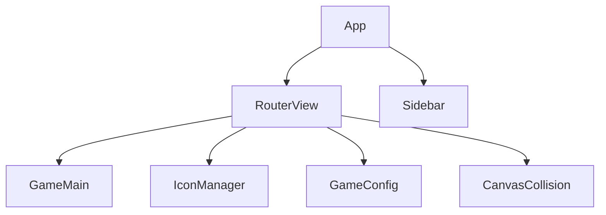

# 游戏系统架构

## 前端技术栈
- 框架: Vue 3 + TypeScript
- 状态管理: Pinia
- 路由: Vue Router
- 物理引擎: Matter.js
- 构建工具: Vite

## 核心路由
1. / - 球球游戏主界面
2. /icon-manager - 图标管理
3. /game-config - 游戏配置
4. /canvas-collision - 小球碰撞实验

## 组件结构

## 样式系统
- SCSS预处理器
- 响应式布局
- 移动端适配
