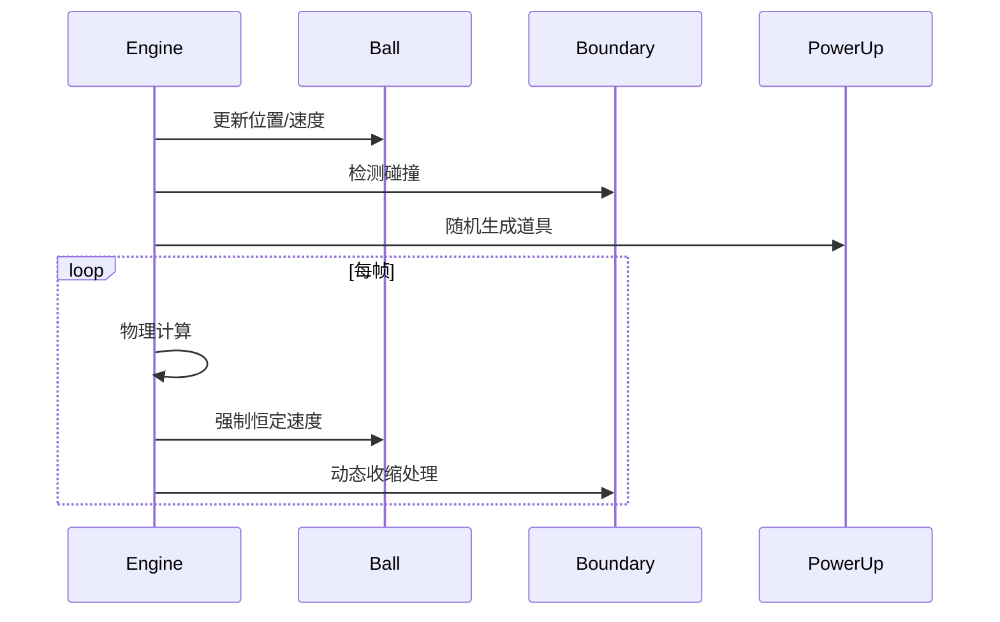

# 游戏核心流程

## 游戏初始化流程
1. 创建物理引擎实例
2. 初始化游戏边界
3. 创建玩家球体
4. 设置碰撞检测系统
5. 启动渲染循环

## 游戏主循环

```mermaid
sequenceDiagram
    participant Engine
    participant Ball
    participant Boundary
    participant PowerUp
    
    Engine->>Ball: 更新位置/速度
    Engine->>Boundary: 检测碰撞
    Engine->>PowerUp: 随机生成道具
    loop 每帧
        Engine->>Engine: 物理计算
        Engine->>Ball: 强制恒定速度
        Engine->>Boundary: 动态收缩处理
    end
```

## 道具交互流程
1. 球体碰撞道具
2. 根据道具类型触发效果:
   - 尖刺: 获得攻击能力
   - 爱心: 恢复生命值
3. 移除已使用道具
4. 重置道具冷却时间

