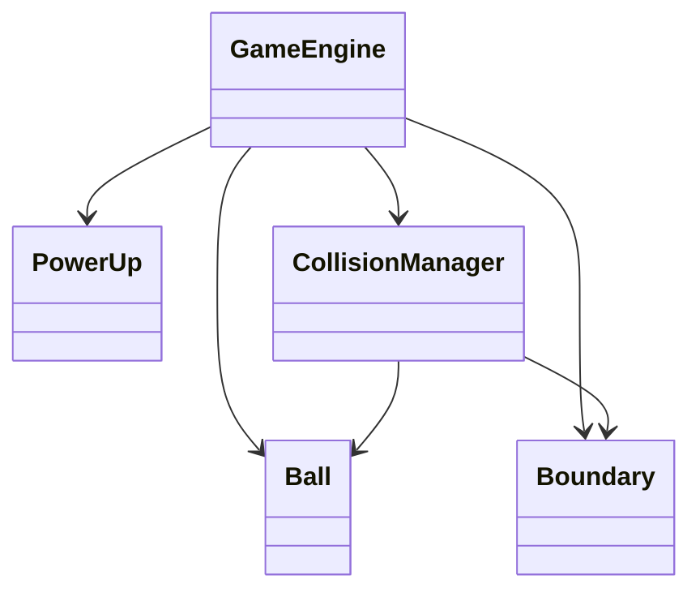

# 游戏数据模型

## 核心实体
1. Ball (球体)
   - 属性: position, velocity, radius
   - 行为: 物理碰撞、速度控制

2. Boundary (边界)
   - 属性: position, size, color
   - 行为: 动态收缩、碰撞检测

3. PowerUp (道具)
   - 类型: 
     - Spike (尖刺): 使球体获得攻击能力
     - Heart (爱心): 恢复生命值
   - 行为: 随机生成、旋转动画

## 物理系统
- 引擎: Matter.js
- 特性:
  - 恒定速度控制
  - 边界碰撞检测
  - 道具交互系统

## 状态管理

